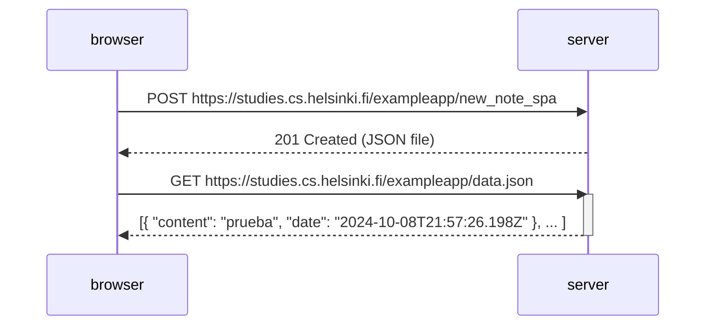

```mermaid
   sequenceDiagram
    participant browser
    participant server

    browser->>server: POST https://studies.cs.helsinki.fi/exampleapp/new_note_spa
    server-->>browser: 201 Created (JSON file)

    browser->>server: GET https://studies.cs.helsinki.fi/exampleapp/data.json
    activate server
    server-->>browser: [{ "content": "prueba", "date": "2024-10-08T21:57:26.198Z" }, ... ]
    deactivate server
```